# Alur Kerja Sistem KasPOS - Dokumentasi Lengkap

Dokumentasi ini menjelaskan alur kerja sistem **KasPOS** secara komprehensif, mencakup seluruh role dan modul dari **Front Office** hingga **Back Office**.

---

## 📊 Overview Sistem

KasPOS adalah sistem Point of Sale (POS) berbasis Laravel + React/Inertia dengan fitur:

```mermaid
graph TB
    subgraph "FRONT OFFICE"
        PELANGGAN[👤 Pelanggan]
        KASIR[💵 Kasir]
        WAITER[🍽️ Waiter]
        KITCHEN[👨‍🍳 Kitchen]
    end
    
    subgraph "BACK OFFICE"
        ADMIN[👑 Super Admin]
        MANAGER[📊 Manager]
        INVENTORY[📦 Inventory Staff]
        FINANCE[💰 Finance]
    end
    
    subgraph "SISTEM"
        POS[🖥️ POS System]
        KDS[📺 Kitchen Display]
        DASHBOARD[📈 Dashboard]
        REPORTS[📄 Reports]
    end
    
    PELANGGAN --> POS
    KASIR --> POS
    WAITER --> POS
    POS --> KDS
    KDS --> KITCHEN
    ADMIN --> DASHBOARD
    MANAGER --> REPORTS
    INVENTORY --> DASHBOARD
    FINANCE --> REPORTS
```



---

## 🎯 FRONT OFFICE

### 1. 👤 Pelanggan (Customer)

#### Alur Kerja Self-Order (via QR Code Meja)


**Akses Fitur:**
| Fitur | Lokasi | Deskripsi |
|-------|--------|-----------|
| Lihat Menu | `/` atau `/table/{id}` | Browse kategori & produk |
| Tambah ke Cart | Frontend | Pilih item, qty, varian |
| Submit Order | `HomeController@store` | Buat transaksi pending |
| Lihat Status | - | Update dari Kitchen |

---

### 2. 💵 Kasir (Cashier)

#### Alur Kerja Shift Kasir


**Alur Transaksi Penjualan:**


**Akses Fitur Kasir:**
| Fitur | Route | Controller Method |
|-------|-------|-------------------|
| Buka POS | `/pos` | `PosController@index` |
| Buka Shift | `/pos/open-cashier-shift` | `PosController@openCashierShift` |
| Tutup Shift | `/pos/close-cashiers` | `PosController@closeCashierShift` |
| Proses Transaksi | `/pos` (POST) | `PosController@store` |
| Cari produk barcode | `/pos/products/search-barcode` | `PosController@searchByBarcode` |
| Pending Transactions | `/pos/pending-transactions` | `PosController@pendingTransaction` |
| History Transactions | `/pos/history-transactions` | `PosController@historyTransaction` |
| Cetak Struk | `/pos/print-receipt` | `PosController@receipt` |
| Kirim ke Kitchen | `/pos/send-kitchen` | `PosController@sendKitchen` |
| Buka Meja | `/pos/update-table` | `PosController@openTable` |
| Discount per Item | `/pos/discount-per-item` | `PosController@discountPerItem` |

---

### 3. 🍽️ Waiter

Waiter berinteraksi dengan sistem melalui POS untuk:


**Fitur Khusus Waiter:**
- Assign meja ke transaksi
- Input pesanan pelanggan
- Kirim pesanan ke Kitchen Display
- Monitor status pesanan

---

### 4. 👨‍🍳 Kitchen (Dapur)

#### Alur Kerja Kitchen Display System (KDS)


**Kitchen Display Interface:**

| Status | Warna | Aksi |
|--------|-------|------|
| `pending` | 🟡 Kuning | Menunggu diproses |
| `cooking` | 🔵 Biru | Sedang dimasak |
| `done` | 🟢 Hijau | Siap disajikan |
| `cancelled` | 🔴 Merah | Dibatalkan |

**Akses Fitur Kitchen:**
| Fitur | Route | Controller Method |
|-------|-------|-------------------|
| Kitchen Display | `/kitchen` | `TransactionKitchenController@index` |
| List Orders | `/kitchen/list-orders` | `TransactionKitchenController@listOrders` |
| Update Status | `/kitchen/{id}/update` | `TransactionKitchenController@update` |

---

## 🏢 BACK OFFICE

### 5. 👑 Super Admin

Super Admin memiliki akses penuh ke seluruh sistem.

#### Alur Kerja Harian Super Admin


**Akses Lengkap Super Admin:**

| Modul | Routes | Deskripsi |
|-------|--------|-----------|
| Dashboard | `/dashboard` | Analytics & overview |
| Users | `/users/*` | Kelola akun pengguna |
| Roles | `/roles/*` | Kelola role & hak akses |
| Permissions | `/permissions/*` | Kelola permission |
| Products | `/products/*` | Kelola produk |
| Categories | `/categories/*` | Kelola kategori |
| Suppliers | `/suppliers/*` | Kelola supplier |
| Materials | `/materials/*` | Kelola bahan baku |
| Checking Stocks | `/checking-stocks/*` | Stock opname |
| Orders | `/orders/*` | Purchase orders ke supplier |
| Transactions | `/transactions/*` | Transaksi penjualan |
| Expenses | `/expenses/*` | Kelola pengeluaran |
| Reports | `/reports/*` | Berbagai laporan |
| Settings | `/setting-stores/*` | Pengaturan toko |
| Audit Logs | `/audit-logs/*` | Log aktivitas sistem |

---

### 6. 📊 Manager / Supervisor

#### Fokus Utama: Monitoring & Reporting

```mermaid
flowchart TD
    M[Manager Login] --> D[Dashboard]
    
    D --> A[📈 Lihat Statistik Penjualan]
    D --> B[📉 Monitor Stok Rendah]
    D --> C[💰 Review Expenses]
    D --> E[📊 Generate Reports]
    
    A --> A1[Daily Sales]
    A --> A2[Monthly Trends]
    A --> A3[Top Products]
    
    B --> B1[Low Stock Alert]
    B --> B2[Request Purchase Order]
    
    E --> E1[Sales Report]
    E --> E2[Stock Report]
    E --> E3[Cash Flow Report]
    E --> E4[Profit/Loss Report]
```



**Dashboard Analytics:**
- Total penjualan (harian/bulanan)
- Top 10 produk terlaris
- Stok rendah (low stock alerts)
- Grafik penjualan per kategori
- Perbandingan month-over-month

**Reports Available:**
| Report | Route | Deskripsi |
|--------|-------|-----------|
| Cash Flow | `/reports/cash-flow` | Arus kas masuk/keluar |
| Purchase | `/reports/purchase` | Laporan pembelian |
| Sales | `/reports/sale` | Laporan penjualan |
| Stock | `/reports/stock` | Laporan stok |
| Card Stock | `/reports/card-stock` | Kartu stok per item |
| Profit/Loss | `/reports/profit-loss` | Laporan laba rugi |

---

### 7. 📦 Inventory / Gudang

#### Alur Kerja Inventory Staff


**Akses Fitur Inventory:**
| Fitur | Route | Deskripsi |
|-------|-------|-----------|
| Products | `/products` | Lihat & kelola produk |
| Materials | `/materials` | Bahan baku & stok |
| Checking Stocks | `/checking-stocks` | Stock opname |
| Purchase Orders | `/orders` | Pembelian ke supplier |
| Purchase Returns | `/purchase-returns` | Retur pembelian |
| Suppliers | `/suppliers` | Data supplier |

---

### 8. 💰 Finance / Keuangan

#### Alur Kerja Finance Staff


**Struktur Expense Management:**
```
📁 Expense Categories
├── 📂 Operasional
│   ├── Listrik
│   ├── Air
│   └── Internet
├── 📂 Gaji
│   ├── Karyawan Tetap
│   └── Part-time
├── 📂 Supplies
│   ├── Bahan Baku
│   └── Packaging
└── 📂 Marketing
    ├── Ads
    └── Promo
```

**Akses Fitur Finance:**
| Fitur | Route | Deskripsi |
|-------|-------|-----------|
| Transactions | `/transactions` | Review transaksi |
| Transaction Returns | `/transaction-returns` | Proses retur |
| Expenses | `/expenses` | Input pengeluaran |
| Expense Categories | `/expense-categories` | Kategori pengeluaran |
| Expense Subcategories | `/expense-subcategories` | Sub-kategori |
| Cash Flow Report | `/reports/cash-flow` | Arus kas |
| Profit/Loss | `/reports/profit-loss` | Laba rugi |

---

## 🔄 Alur Transaksi End-to-End

### Complete Transaction Flow


---

## 📱 Fitur Tambahan

### Discount & Promo System


| Tipe | Route | Deskripsi |
|------|-------|-----------|
| Coupon | `/coupons` | Kode promo |
| Discount Package | `/discount-packages` | Paket bundling |
| Discount Product | `/discount-products` | Diskon per produk |

---

### Customer Loyalty Program


---

### Table Management (Resto/Cafe)

```mermaid
graph TD
    T[Tables] --> S{Status}
    S -->|Available| A[🟢 Kosong]
    S -->|Occupied| B[🔴 Terisi]
    S -->|Reserved| C[🟡 Dipesan]
    
    A --> QR[Generate QR Code]
    QR --> SCAN[Customer Scan]
    SCAN --> ORDER[Self Order]
    ORDER --> B
```



---

## 🔐 Role & Permission Matrix

| Role | Dashboard | POS | Kitchen | Products | Orders | Transactions | Reports | Settings | Users |
|------|:---------:|:---:|:-------:|:--------:|:------:|:------------:|:-------:|:--------:|:-----:|
| Super Admin | ✅ | ✅ | ✅ | ✅ | ✅ | ✅ | ✅ | ✅ | ✅ |
| Manager | ✅ | ❌ | ❌ | ✅ | ✅ | ✅ | ✅ | ❌ | ❌ |
| Kasir | ❌ | ✅ | ❌ | ❌ | ❌ | ❌ | ❌ | ❌ | ❌ |
| Kitchen | ❌ | ❌ | ✅ | ❌ | ❌ | ❌ | ❌ | ❌ | ❌ |
| Inventory | ❌ | ❌ | ❌ | ✅ | ✅ | ❌ | ✅ | ❌ | ❌ |
| Finance | ❌ | ❌ | ❌ | ❌ | ❌ | ✅ | ✅ | ❌ | ❌ |

---

## 📁 Struktur Data Utama

### Entity Relationship Overview


---

## 📝 Kesimpulan

Sistem KasPOS mengintegrasikan:

1. **Front Office**: Operasional harian dengan POS, Kitchen Display, dan self-ordering
2. **Back Office**: Manajemen inventory, keuangan, dan reporting
3. **Role-based Access**: Kontrol akses berdasarkan role pengguna
4. **Real-time Updates**: Kitchen Display System untuk koordinasi dapur
5. **Comprehensive Reporting**: Laporan lengkap untuk analisis bisnis

Setiap role memiliki workflow yang terintegrasi untuk memastikan operasional bisnis berjalan lancar dari pesanan hingga pelaporan keuangan.
